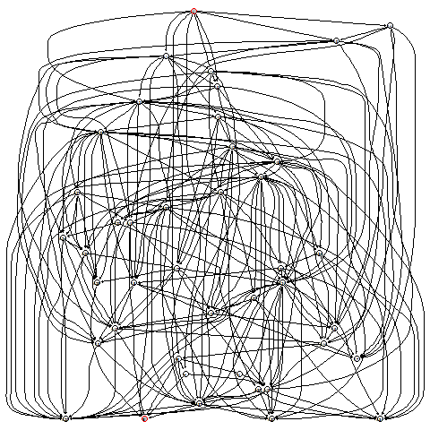
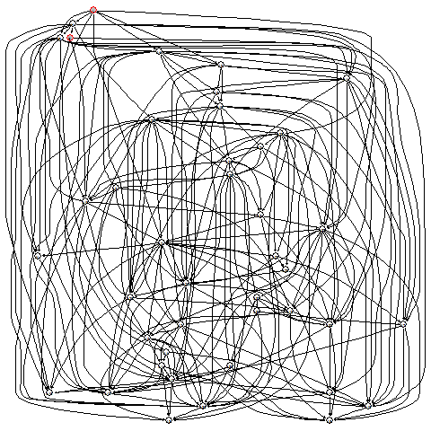
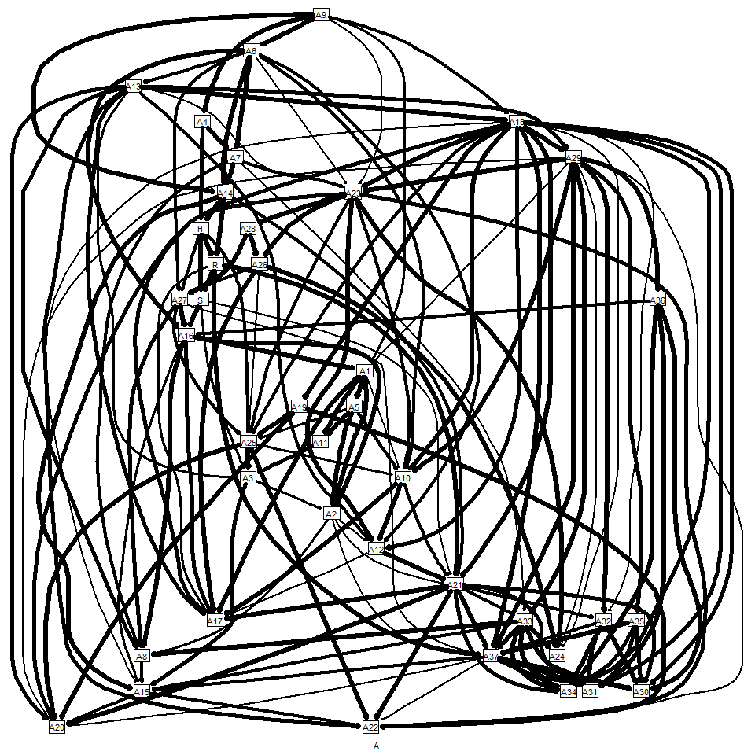
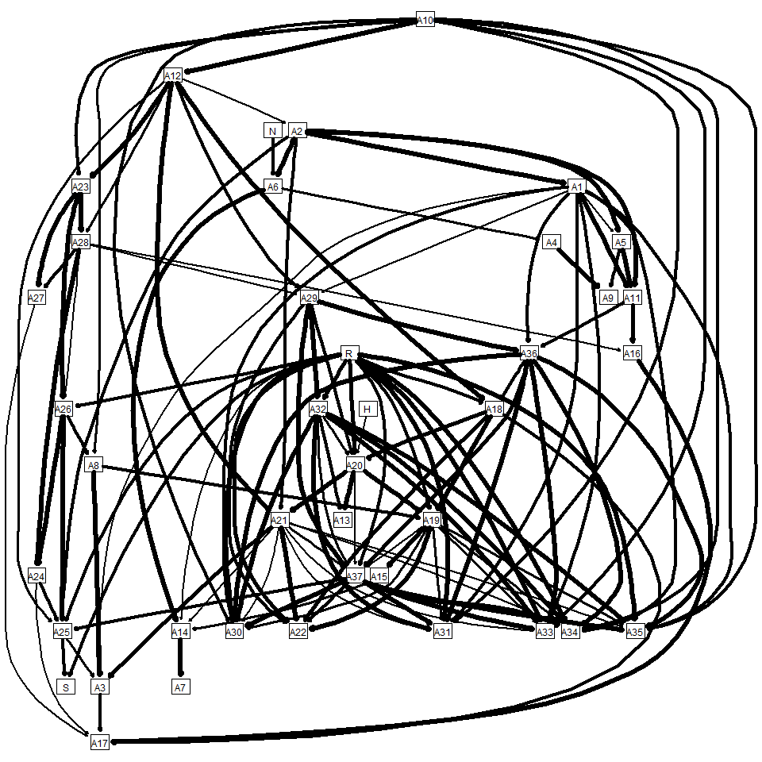
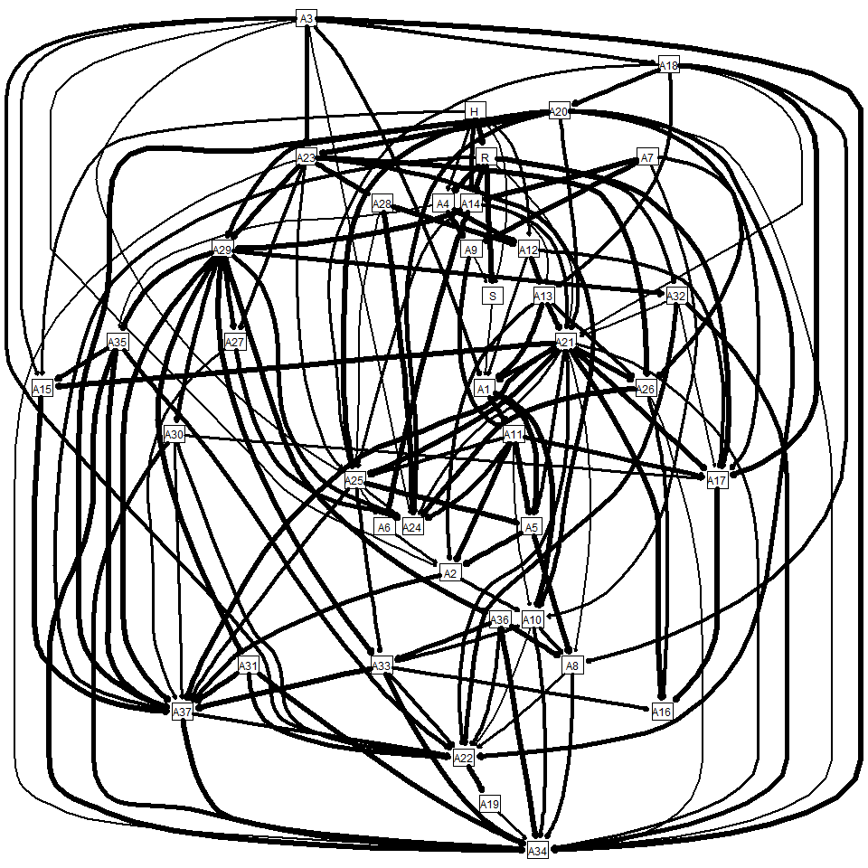

```{r initial, cache.path="../Yelp_Data/", cache=TRUE, echo=FALSE, results='hide', warning=FALSE, message=FALSE}
load("../Yelp_Data/Raw.RData")
source("./packageskit.R")
source("./functions.R")
yelp_business <- data.frame(yelp_business, Loc = City_Tag(yelp_business$latitude, yelp_business$longitude))
```

# Get Data

This project will analyze the data set from [Yelp Dataset Challenge](http://www.yelp.com/dataset_challenge). The data set is downloaded from [this link](https://d396qusza40orc.cloudfront.net/dsscapstone/dataset/yelp_dataset_challenge_academic_dataset.zip). I obtained and pre-processed the data set through the codes in [0GetData.R](0GetData.R). Here are files compressed in the zip file:

```{r overview, cache.path="../Yelp_Data/", cache=TRUE, echo=FALSE, warning=FALSE}
print(unzip("../Yelp_Data/yelp.zip", list = TRUE))
```

Yelp is collecting the users' review for the businesses around the major cities across North America and Europe. Data set *business* collects the information from `r dim(yelp_business)[1]` businesses. Data set *checkin* stores `r dim(yelp_checkin)[1]` durations and frequencies a user stay in every business. Data set *review* sumarizes `r dim(yelp_review)[1]` reviews for a registed business. Data set *tip* summarizes the `r dim(yelp_tip)[1]` recommendations for a business. Data set *user* collects the information from  `r dim(yelp_user)[1]` registed users.


# Question and hypothesis

If the data set could show us the variables how users evaluate a businesses, Will we figure a global standard across cities or many local standards in each city?  
If one set of variables gathered from one city could cluster the businesses in the other city, they represent the global standard for this business. Otherwise, every city has the local standard. 

# Preprocess Raw Business Data
## Adjust the locations of businesses
Although each bussines in the business data set has the information of its location (full_address, city, state), these information are a mass because there are many users' typo. We use the geographical information (longitude, latitude) to adjust the location of each business. The result is that we add the new column 'Loc' to the business data set with the following codes.

```
yelp_business <- data.frame(yelp_business, Loc = City_Tag(yelp_business$latitude, yelp_business$longitude))
```

## Decide the categories for this project
When we focus on the one category of business, such as Pizza or Chinese restaurants, we could compute the relations of attributes and stars of businesses. At first, We calcuated how many categories are collected in the data set and how many businesses are labeled in every category. Here are the top 30 categories. We find out some comparable categories in this list. For example, "Fast Food" and "Pizza"; "Chinese" and "Italian".

```{r categories, cache.path="../Yelp_Data/", cache=TRUE, echo=FALSE, warning=FALSE, message=FALSE}
sort( table(unlist(yelp_business$categories)) , decreasing = TRUE) [1:30]
```

We pick up Fast Food and Chinese resturant as the cases.

## Modifications on the variables
1. Delete the variables captured less than 10% observations
2. Transfer all attribute vectors to numerics
3. Tag variable names with simple characters
```{r modify_variables, cache.path="../Yelp_Data/", cache=TRUE, echo=FALSE, warning=FALSE, message=FALSE}
FoodCategories <- names( sort( table(unlist(yelp_business$categories)) , decreasing = TRUE) )[c(13,14,15,18,19,21,22,23,24,25)]

yelp_FastFood <- yelp_business[grep(gsub("[()]","",FoodCategories )[1], gsub("[()]","",yelp_business$categories) ),c("business_id","Loc","stars","hours", "review_count", "neighborhoods", "attributes")]
yelp_FastFood <- Variables_Transfer(yelp_FastFood)
FastFood_Variables_Tags <- names(yelp_FastFood)

yelp_Chinese <- yelp_business[grep(gsub("[()]","",FoodCategories )[8], gsub("[()]","",yelp_business$categories) ),c("business_id","Loc","stars","hours", "review_count", "neighborhoods", "attributes")]
yelp_Chinese <- Variables_Transfer(yelp_Chinese)
Chinese_Variables_Tags <- names(yelp_Chinese)
```

# Baysian Belief Network
We used the package **bnlearn**
[Tutorial of **bnlearn**](http://www.jstatsoft.org/v35/i03/)

# Explore category data in BBN

Fixed: categories

## variables in analysis
Primary: stars(numeric)
secondary: Loc(city -> Factor),  neighborhoods(numbers), hours(types -> numeric)
Third: attributes(numbers, NA -> 0, 1 -> 2, 2 -> 3, etc.)

## Summary after exploration
* Stars show the common evaluation for fast food.
Fast food in each city has a specific set of variables to influence the stars
People evalute the Chinese resturants on a specific attributes rather than a score. Generally the attributes are "Outdoor.Seating" and "Has.TV".

```{r FastFood_hc, cache.path="../Yelp_Data/", cache=TRUE, echo=FALSE, warning=FALSE, message=FALSE, results='hide'}
names(yelp_FastFood) <- c("ID", "L", "S", "H", "R", "N", paste0("A",1:37))
yelp_FastFood.hc <- hc(yelp_FastFood[,c(3,2,4:43)])
hc.opt <- list(nodes = c("S", "L"), arcs = c("S", "L"), col = "red", fill = "grey")
png("fastfood_explore.png", width = 480, height = 480)
graphviz.plot(yelp_FastFood.hc, highlight = hc.opt)
dev.off()
```


* Somethings are more important than stars for the guests of Chinese resturants
"Loc" decide the hours of open of Chinese resturants. Hours of open directly influence "stars". "Loc" and "stars" decide the other attributes of Chinese resturants.  
"Outdoor.Seating" and "Has.TV" are the notes without children.

```{r Chinese_hc, cache.path="../Yelp_Data/", cache=TRUE, echo=FALSE, warning=FALSE, message=FALSE, results='hide'}
names(yelp_Chinese) <- c("ID", "L", "S", "H", "R", "N", paste0("A",1:37))
yelp_Chinese.hc <- hc(yelp_Chinese[,c(3,2,4:43)])
hc.opt <- list(nodes = c("S", "L"), arcs = c("S", "L"), col = "red", fill = "grey")
png("Chinese_explore.png", width = 480, height = 480)
graphviz.plot(yelp_Chinese.hc, highlight = hc.opt)
dev.off()
```


We decide to build and analyze the evaluation models of fast food resturants and Chinese resturants in Phoenix and Charlotte. There are `r table(yelp_FastFood$L)["Phoenix"]` fast food resturants in Phoenix and `r table(yelp_FastFood$L)["Charlotte"]`fast food resturants in Charlotte, and there are `r table(yelp_Chinese$L)["Phoenix"]` fast food resturants in Phoenix and `r table(yelp_Chinese$L)["Charlotte"]`fast food resturants in Charlotte. The method to build the evaluation models are cited from *bnlearn* development team's [blog article]( http://www.bnlearn.com/research/genetics14/)

# Build evaluation model for fast food in Phoenix

We set alpha = 0 because some attributes had to dependend on the other attributes.
```{r Ph_FF_Model, cache.path="../Yelp_Data/", cache=TRUE, echo=FALSE, warning=FALSE, message=FALSE, results='hide'}
Phoenix_FastFood = subset(yelp_FastFood, L == "Phoenix")[,3:43]
FastFood001 = vector(10, mode = "list")

for (i in 1:10)
  FastFood001[[i]] = xval.the.model(Phoenix_FastFood, alpha = 0, ridge = FALSE)
# stopCluster(cl)

png("FastFood001.png", width = 960, height = 960)
FastFood001.gr <- gather.arc(FastFood001, names(Phoenix_FastFood), "dot", 0.01, enhanced = FALSE)
dev.off()
```


The final nodes are `r c(FastFood_Variables_Tags[6+20], FastFood_Variables_Tags[6+22], FastFood_Variables_Tags[6+30], FastFood_Variables_Tags[6+31], FastFood_Variables_Tags[6+34])`.

# Build evaluation model for fast food in Charlotte
```{r Ch_FF_Model, cache.path="../Yelp_Data/", cache=TRUE, echo=FALSE, warning=FALSE, message=FALSE, results='hide'}
Charlotte_FastFood = subset(yelp_FastFood, L == "Charlotte")[,3:43]
FastFood002 = vector(10, mode = "list")

for (i in 1:10)
  FastFood002[[i]] = xval.the.model(Charlotte_FastFood, alpha = 0, ridge = FALSE)

png("FastFood002.png", width = 960, height = 960)
FastFood002.gr <- gather.arc(FastFood002, names(Charlotte_FastFood), "dot", 0.01, enhanced = FALSE)
dev.off()
```


# Build evaluation model for Chinese resturants in Phoenix
```{r Ph_CH_Model, cache.path="../Yelp_Data/", cache=TRUE, echo=FALSE, warning=FALSE, message=FALSE, results='hide'}
Phoenix_Chinese = subset(yelp_Chinese, L == "Phoenix")[,3:43]
Chinese001 = vector(10, mode = "list")

for (i in 1:10)
  Chinese001[[i]] = xval.the.model(Phoenix_Chinese, alpha = 0, ridge = FALSE)

pred.Chinese001.summary = sapply(Chinese001, `[[`, "predcor")
print(rowMeans(pred.Chinese001.summary))

post.Chinese001.summary = sapply(Chinese001, `[[`, "postcor")
print(rowMeans(post.Chinese001.summary))

png("Chinese001.png", width = 960, height = 960)
Chinese001.gr <- gather.arc(Chinese001, names(Phoenix_Chinese), 'dot', 0.01, enhanced = FALSE)
dev.off()
```


The final notes are

# Build evaluation model for Chinese resturants in Charlotte
```{r Ch_CH_Model, cache.path="../Yelp_Data/", cache=TRUE, echo=FALSE, warning=FALSE, message=FALSE, results='hide'}
Charlotte_Chinese = subset(yelp_Chinese, L == "Charlotte")[,3:43]
Chinese002 = vector(10, mode = "list")

for (i in 1:10)
  Chinese002[[i]] = xval.the.model(Charlotte_Chinese, alpha = 0, ridge = FALSE)

pred.Chinese002.summary = sapply(Chinese002, `[[`, "predcor")
print(rowMeans(pred.Chinese002.summary))

post.Chinese002.summary = sapply(Chinese002, `[[`, "postcor")
print(rowMeans(post.Chinese002.summary))

png("Chinese002.png", width = 960, height = 960)
Chinese002.gr <- gather.arc(Chinese002, names(Charlotte_Chinese), 'dot', 0.01, enhanced = FALSE)
dev.off()
```


 the average predictive correlations by extracting the values  from the 10 runs of cross-validation
 
```{r BBN_brief, cache.path="../Yelp_Data/", cache=TRUE, echo=FALSE, warning=FALSE, message=FALSE, results="asis"}
pred.FastFood001.summary = sapply(FastFood001, `[[`, "predcor")

post.FastFood001.summary = sapply(FastFood001, `[[`, "postcor")

pred.FastFood002.summary = sapply(FastFood002, `[[`, "predcor")

post.FastFood002.summary = sapply(FastFood002, `[[`, "postcor")

pred.Chinese001.summary = sapply(Chinese001, `[[`, "predcor")

post.Chinese001.summary = sapply(Chinese001, `[[`, "postcor")

pred.Chinese002.summary = sapply(Chinese002, `[[`, "predcor")

post.Chinese002.summary = sapply(Chinese002, `[[`, "postcor")

library(xtable)
Brief.tb <- xtable( cbind(pred = rowMeans(pred.FastFood001.summary), post = rowMeans(post.FastFood001.summary),
                          pred = rowMeans(pred.FastFood002.summary), post = rowMeans(post.FastFood002.summary),
                          pred = rowMeans(pred.Chinese001.summary), post = rowMeans(post.Chinese001.summary),
                          pred = rowMeans(pred.Chinese002.summary), post = rowMeans(post.Chinese002.summary) ) )
addtorow <- list()
addtorow$pos <- list(0, 0)
addtorow$command <- c("& \\multicolumn{2}{c}{Phoenix} & \\multicolumn{2}{c}{Charlotte} & \\multicolumn{2}{c}{Phoenix} & \\multicolumn{2}{c}{Charlotte} \\","")

print(Brief.tb, add.to.row = addtorow, type = "html")
```
